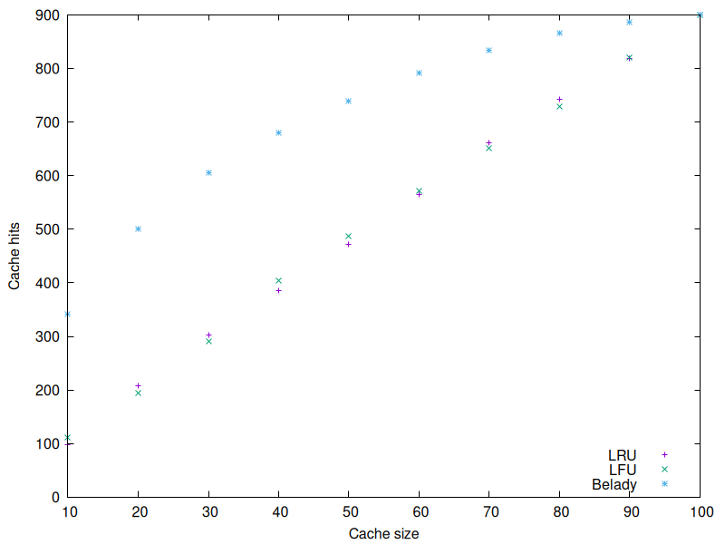

# HWC Caches. LRU, LFU, Belady's optimal cache

## How to run

```bash
./build/main/main <<< "2 6 3 3 1 2 1 2" # cache_size Nelem elem1 elem2 ...
```
output is 
```bash
Cache type   N hits
Belady       3
LRU          3
LFU          1
```

### Benchmark
input : uniform random integers [0: 100) with input size 100'000



To reproduce benchmarks one needs to build the project and run
```bash
./build/benchmark/benchmark
cd benchmark
gnuplot script.gp
open cache_hit_statistics.png
```


## How to build: CMAKE
```bash
cmake -S . -B build -G Ninja \
  -DCMAKE_C_COMPILER=gcc-14 \
  -DCMAKE_CXX_COMPILER=g++-14

cmake --build build
ctest --test-dir build --output-on-failure
```
